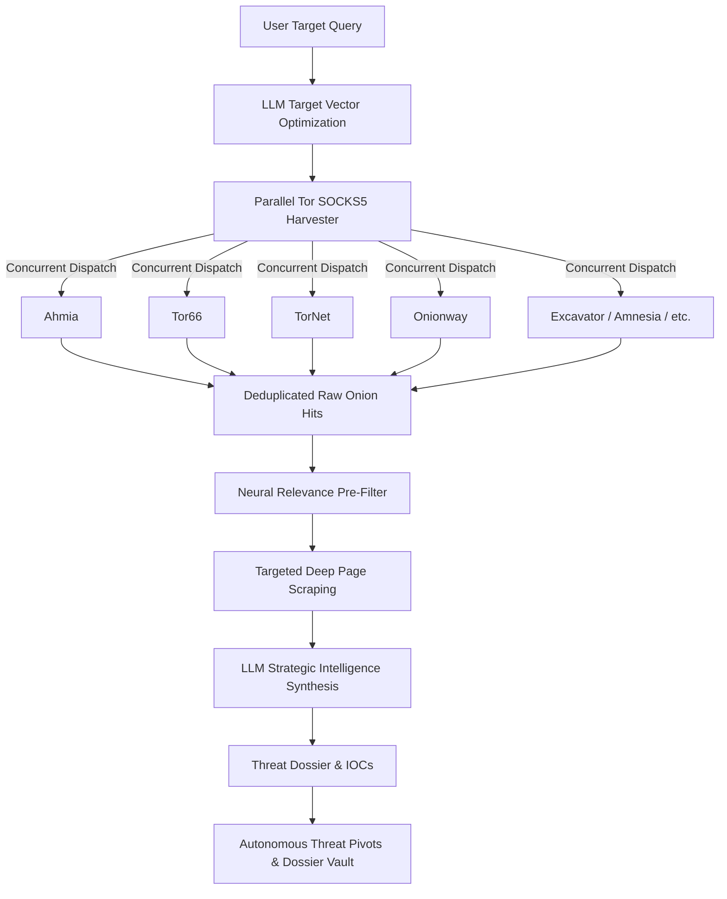

# 🕵️‍♂️ DRAK WEB // AI-Powered Dark Web OSINT & Threat Intelligence

<div align="center">


**High-Speed Autonomous Dark Web Harvester & Neural Intelligence Engine**

[Key Features](#-key-features) •
[Architecture](#-architecture) •
[Quick Start](#-quick-start) •
[Configuration](#-configuration) •
[Supported LLMs](#-supported-neural-engines) •
[Docker Deployment](#-docker-deployment) •
[Disclaimer](#-disclaimer)

</div>

---

## ⚡ Overview

**DRAK WEB** is an advanced open-source threat intelligence (OSINT) platform engineered to autonomously search, scrape, and synthesize threat data across the dark web (`.onion` hidden services) via the Tor network.

Powered by modern Large Language Models (LLMs), DRAK WEB converts vague target vectors into optimized dark web queries, executes concurrent multi-engine sweeps across resilient onion nodes, filters signals from noise, extracts deep page artifacts, and streams actionable cyber threat intelligence reports.

---

## 🎯 Key Features

- **🌐 Multi-Engine Dark Web Harvester**: Concurrent parallel querying across top-tier dark web search engines (Ahmia, Tor66, TorNet, Onionway, Amnesia, Excavator, The Deep Searches, Torland, OnionLand).
- **🛡️ Neural Target Vector Optimization**: Intelligently expands and refines user queries for dark web syntax.
- **⚡ Smart Relevance Filter & Deep Extraction**: Eliminates 90% of noise by neural pre-filtering before initiating targeted concurrent scraping of `.onion` artifacts.
- **📊 Strategic Intelligence Synthesis**: Real-time streaming generation of comprehensive threat dossiers with threat actor attribution, IOC analysis, risk scoring, and defensive recommendations.
- **📂 Investigation Dossier Vault**: Persistent investigation storage with full export capabilities (Markdown/JSON) and complete vault management (Load, Remove, Purge).
- **🎯 Autonomous Threat Pivots**: AI-driven recommendation of subsequent pivot targets to guide deeper investigations.
- **🤖 Provider Agnostic Neural Engine**: Seamless support for OpenAI, Anthropic Claude, Google Gemini, OpenRouter, Ollama local models (`dolphin-llama3`, `mistral`, etc.), and custom OpenAI-compatible gateways (Groq, vLLM, LM Studio).
- **🔒 Integrated Tor Proxy Management**: Built-in Tor bundle manager (`setup_tor.py`) for automated background SOCKS5 proxy bootstrapping.

---

## 🏗️ Architecture



---

## 🚀 Quick Start

### 1. Clone the Repository
```bash
git clone https://github.com/aegisforensicsmonk/fuking-brooooo.git
cd fuking-brooooo
```

### 2. Set Up Virtual Environment & Dependencies
```bash
python -m venv venv
# Windows
.\venv\Scripts\activate
# Linux / macOS
source venv/bin/activate

pip install -r requirements.txt
```

### 3. Bootstrap Tor Proxy
Ensure you have a Tor SOCKS5 proxy active on `127.0.0.1:9050`.

On Windows, you can automatically download and start the bundled Tor expert proxy:
```bash
python setup_tor.py
```

On Linux:
```bash
sudo apt update && sudo apt install tor -y
sudo systemctl start tor
```

### 4. Configure Environment Variables
Copy `.env.example` to `.env` and configure your API keys or local LLM base URLs:
```bash
cp .env.example .env
```

### 5. Launch DRAK WEB
```bash
streamlit run ui.py
```
Open your browser and navigate to `http://localhost:8501`.

---

## ⚙️ Configuration (`.env`)

Configure your desired LLM providers in `.env`:

```ini
# OpenAI
OPENAI_API_KEY=your_openai_api_key

# Anthropic Claude
ANTHROPIC_API_KEY=your_anthropic_api_key

# Google Gemini
GOOGLE_API_KEY=your_gemini_api_key

# OpenRouter
OPENROUTER_API_KEY=your_openrouter_api_key
OPENROUTER_BASE_URL=https://openrouter.ai/api/v1

# Local Ollama
OLLAMA_BASE_URL=http://localhost:11434
OLLAMA_API_KEY=optional_key

# Custom Gateway (Groq / LM Studio / vLLM)
CUSTOM_API_BASE_URL=https://api.groq.com/openai/v1
CUSTOM_API_KEY=your_custom_key
CUSTOM_API_MODEL=llama-3.3-70b-versatile
```

---

## 🤖 Supported Neural Engines

| Provider | Supported Models |
| :--- | :--- |
| **OpenAI** | GPT-4o, GPT-4o-mini, GPT-4-turbo, GPT-3.5-turbo |
| **Anthropic** | Claude 3.5 Sonnet, Claude 3 Opus, Claude 3 Haiku |
| **Google Gemini** | Gemini 1.5 Pro, Gemini 1.5 Flash |
| **OpenRouter** | Any OpenRouter model ID |
| **Local Ollama** | Dolphin-Llama3, Llama 3, Mistral, Qwen, DeepSeek |
| **Local llama.cpp** | Any local OpenAI-compatible endpoint |

---

## 🐳 Docker Deployment

You can build and deploy DRAK WEB containerized with Tor and Streamlit pre-configured:

```bash
# Build Docker image
docker build -t drak-web .

# Run container with ports exposed
docker run -d -p 8501:8501 --name drak_web_instance drak-web
```

---

## 📂 Project Structure

```
├── .streamlit/             # Streamlit theme & UI configuration
├── investigations/         # Saved threat dossiers in JSON format
├── config.py               # Environment configuration loader
├── health.py               # Tor & search node health diagnostic routines
├── llm.py                  # LangChain chains, synthesis prompts & filtering
├── llm_utils.py            # Streaming handlers & model resolution
├── requirements.txt        # Python package dependencies
├── scrape.py               # Resilient Tor session scrapers
├── search.py               # Multi-engine onion search harvester
├── setup_tor.py            # Automated Windows Tor bundle installer
├── ui.py                   # Cyber Command Center Streamlit Interface
└── Dockerfile              # Containerization definition
```

---

## ⚠️ Disclaimer

This tool is developed for **authorized cybersecurity research, threat intelligence analysis, and legitimate defensive OSINT investigations only**. Users are responsible for complying with all applicable laws and regulations in their jurisdiction. Do not use this tool for unauthorized, illicit, or malicious activities.
